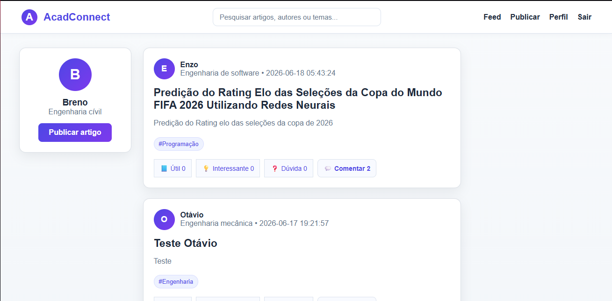
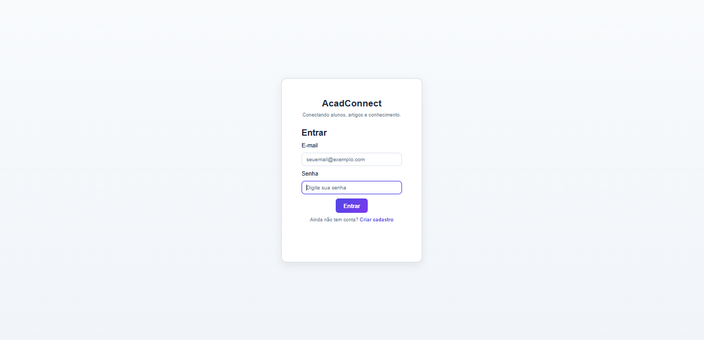
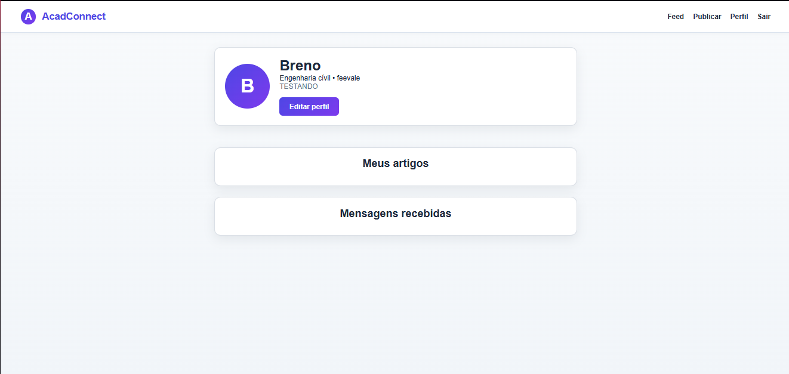

# AcadConnect

<p align="center">


</p>

---

# 📚 Sobre o projeto

AcadConnect é uma rede social acadêmica desenvolvida durante a disciplina de **Introdução à Engenharia** da **Universidade Feevale**.

O sistema foi criado para conectar estudantes e pesquisadores através da publicação de artigos acadêmicos, permitindo interação entre usuários por meio de comentários, reações, compartilhamento de conhecimento e contato direto com os autores.

Além da publicação de artigos, o sistema também incentiva boas práticas acadêmicas, exigindo autoria e referências bibliográficas.

---

# 📰 Feed principal

Após realizar o login, o usuário é direcionado ao feed principal da plataforma, onde pode pesquisar artigos, visualizar publicações recentes, reagir aos conteúdos e acessar os comentários.

<p align="center">

</p>

---

# 🔐 Login

O acesso ao sistema é realizado através de autenticação de usuários cadastrados.

<p align="center">

</p>

---

# ✍️ Publicação de artigos

Cada usuário pode publicar artigos acadêmicos completos, preenchendo todas as informações necessárias para uma publicação organizada.

O sistema permite informar:

- título;
- autores;
- palavras-chave;
- categoria;
- resumo;
- conteúdo completo;
- referências bibliográficas;
- upload do PDF oficial;
- declaração de autoria.

<p align="center">

</p>

<p align="center">

</p>

---

# 📄 Visualização do artigo

Cada publicação possui uma página própria contendo todas as informações do trabalho acadêmico.

<p align="center">

</p>

Além do conteúdo do artigo, o sistema apresenta:

- autores;
- palavras-chave;
- número de visualizações;
- download do PDF;
- referências bibliográficas;
- declaração de responsabilidade acadêmica.

<p align="center">

</p>

Também é possível interagir com o artigo através de comentários, reações e contato direto com o autor.

<p align="center">

</p>

---

# 👤 Perfil do usuário

Cada usuário possui um perfil acadêmico onde pode visualizar seus artigos publicados, editar suas informações e acessar as mensagens recebidas.

<p align="center">

</p>

---

# ✨ Principais funcionalidades

## 👤 Usuários

- Cadastro
- Login e Logout
- Sessões em PHP
- Perfil acadêmico
- Upload de avatar
- Edição de perfil

## 📄 Artigos

- Publicação de artigos
- Edição
- Exclusão
- Upload de PDF
- Download de PDF
- Visualização individual
- Contador de visualizações
- Autores
- Palavras-chave
- Referências bibliográficas

## 💬 Interações

- Comentários
- Reações
  - 👍 Útil
  - 💡 Interessante
  - ❓ Dúvida
- Contato com autor

## 🔍 Feed

- Feed dinâmico
- Pesquisa por título
- Pesquisa por resumo
- Pesquisa por categoria
- Pesquisa por autor
- Exibição de comentários
- Exibição de reações
- Layout responsivo

## 🎓 Ética acadêmica

- Declaração obrigatória de autoria
- Responsabilidade do autor
- Campo de referências bibliográficas

---

# 🛠️ Tecnologias utilizadas

### Front-end

- HTML5
- CSS3
- JavaScript

### Back-end

- PHP

### Banco de Dados

- MySQL

### Ferramentas

- XAMPP
- Visual Studio Code
- Git
- GitHub

---

# 🚀 Como executar

Clone o projeto

```bash
git clone https://github.com/Breno-Alves-da-Silva/Projeto_introducao-engenharias
```

Inicie o Apache e o MySQL através do XAMPP.

Importe o banco de dados MySQL.

Acesse:

```
http://localhost/Projeto_introducao-engenharias
```

---

# 📂 Estrutura do projeto

```text
Projeto_introducao-engenharias/

├── css/
├── js/
├── php/
├── uploads/
├── imagens/
├── index.php
├── feed.php
├── perfil.php
├── publicar.php
├── artigo.php
└── README.md
```

---

# 👨‍💻 Autor

**Breno Alves da Silva**

🎓 Estudante de Engenharia da Computação – Universidade Feevale

💻 Técnico em Desenvolvimento de Sistemas – SENAC

🔗 GitHub

https://github.com/Breno-Alves-da-Silva

💼 LinkedIn

https://www.linkedin.com/in/breno-alves-da-silva

---

⭐ Este projeto foi desenvolvido com o objetivo de aplicar conceitos de desenvolvimento Full Stack, banco de dados, autenticação de usuários, CRUD, upload de arquivos, interações entre usuários e organização de conteúdo acadêmico.
